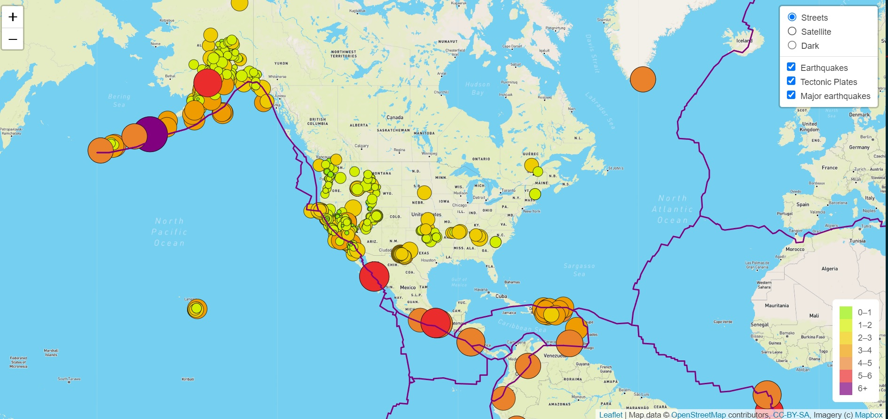

# Mapping Earthquakes

GeoJSON is employed to create a global map with the location and magnitude of earthquakes within the last 7 days, using data from [USGS](https://earthquake.usgs.gov/). The map includes options to display major and all earthquakes, as well as the border of tectonic plates. It also provides 3 map backgroud options: streets, satellite, or dark mode.

*Preview of map on load*